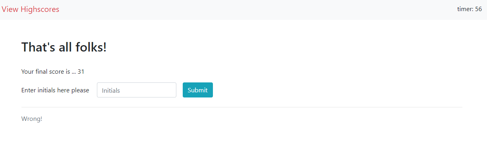

# The Coding Quiz

In line with the request, a timed quiz has been created based on certain criteria so that the user can text themselves along with peers and compare their scores. Please use the link below to access the password generator.

## Functionalities

For the quiz the following criteria have been met to be able to run through the questions and different pages:

- when you click on the start button, the questions page will appear with a question and 4 options to select from (see image 1: the questions page) with a timer countdown.
- Once an answer is clicked the next question will load with a statement verifying if it was correct. (see image 2: answer verification)
- if answer was correct score will be increased by 10, if wrong the timer left will decrease by 10 seconds.
- after the final question or if the timer runs out the game over page will load with your score asking for your initials (see image 3: game over page). the score is the answers you got correct + the time left.
- once you submit your initials the high scores page will load (if no initials entered an error will pop up). The high score page will show any previous scorers scores as well as your new score (see image 4: high scores page)
- on the scores page if you press go back it will take you back to the first screen (see image 5: starting screen), if clear score then the scores will be deleted.
- if you click the view highscores at any time it will jump straight to the high scores page.

Access the quiz here: [Quiz URL](https://christofulee.github.io/chris-homework-W4/)

image 3: game over page
### image 1: the questions page

### image 2: answer verification

### image 3: game over page

### image 4: high scores page

### image 5: starting screen

